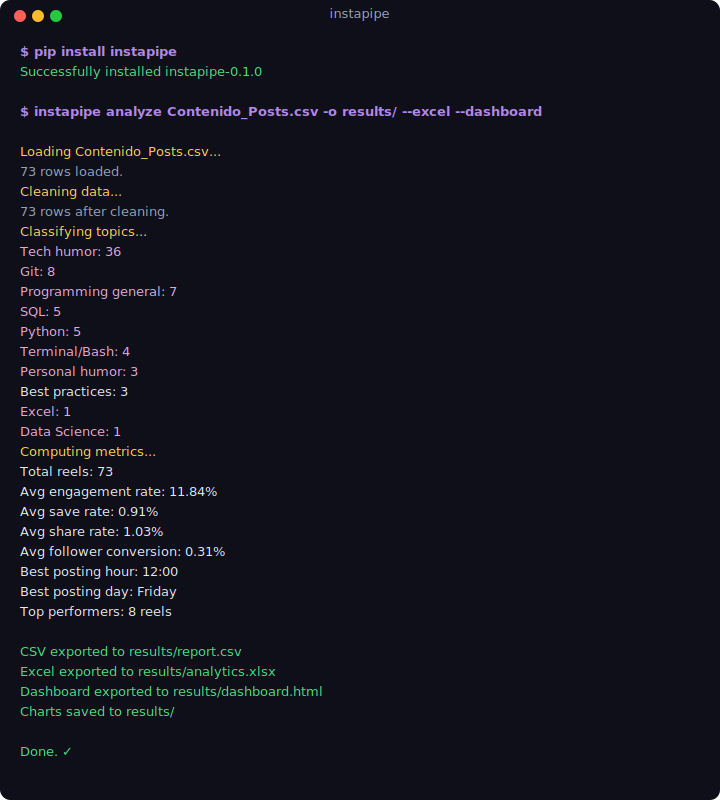
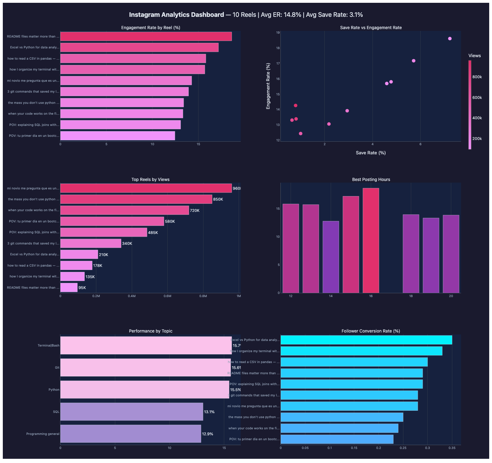
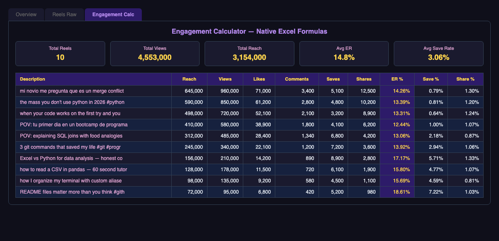
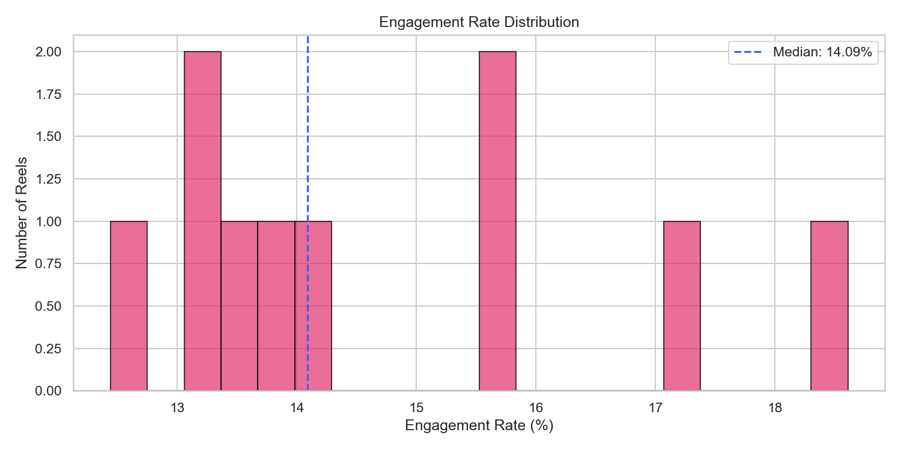
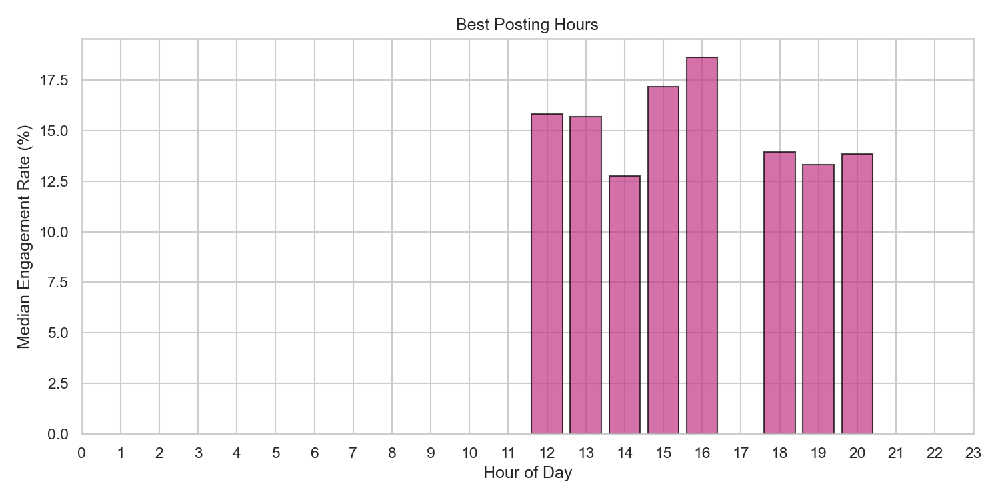
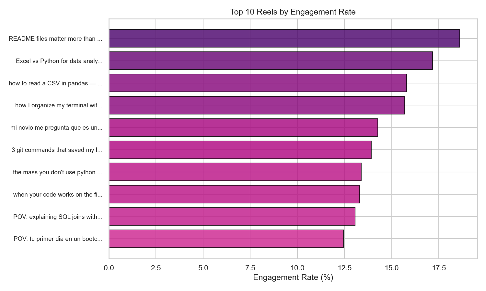
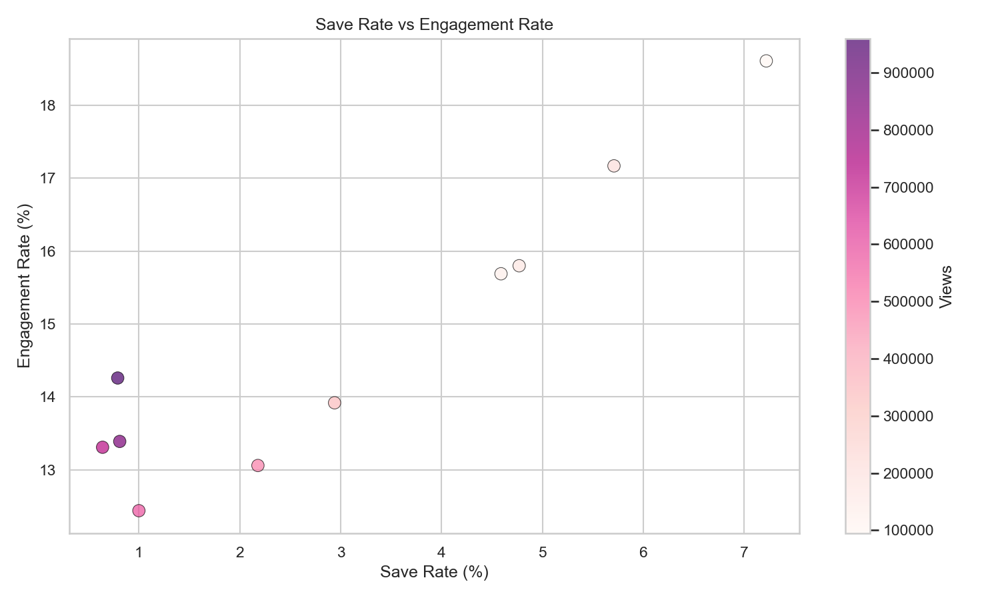

# instapipe

[](https://github.com/aroaxinping/instapipe/actions/workflows/ci.yml)
[](https://pypi.org/project/instapipe/)


Data pipeline for Instagram analytics. Import your exported data from Meta Business Suite, clean it, compute real metrics, and visualize what actually works.

No APIs, no scraping, no third-party tokens. Just your Instagram export files (CSV/XLSX) and Python.

<p align="center">
  
</p>

### Why instapipe?

Most Instagram analytics tools are either paid dashboards, require API tokens, or scrape data in ways that break with every update. instapipe takes a different approach: you export your own data from Meta Business Suite (a manual download, 30 seconds), and instapipe does the rest — cleaning, metric computation, and visualization. You own your data, you control the pipeline, and you can extend it however you want.

---

## What it generates

### Interactive HTML Dashboard

<p align="center">
  
</p>

### Styled Excel Workbook

<p align="center">
  
</p>

### Matplotlib Charts

<p align="center">
  
  
</p>
<p align="center">
  
  
</p>

> Generated from sample data included in `examples/`. Try it yourself:
> ```bash
> instapipe analyze examples/sample_data.csv --output results/ --excel --dashboard
> ```

---

## Architecture

```
instapipe follows a classic ETL pipeline structure:

  Export (Meta Business Suite CSV/XLSX)
        |
        v
  +-----------+
  |  ingest   |  --> Load and validate raw export files (utf-8-sig & utf-16)
  +-----------+
        |
        v
  +-----------+
  |  clean    |  --> Normalize columns (ES/EN), fix types, parse dates
  +-----------+
        |
        v
  +-----------+
  |  metrics  |  --> Compute engagement, save rate, share rate, conversion
  +-----------+
        |
        v
  +-----------+
  |  output   |  --> Dataframes, CSV export, visualizations
  +-----------+
```

### Modules

| Module | What it does |
|---|---|
| `instapipe.ingest` | Reads Instagram export files (CSV, XLSX). Handles Meta Business Suite's utf-16 daily CSVs and utf-8-sig content CSVs transparently. |
| `instapipe.clean` | Maps column names (Spanish/English) to internal names, converts date/number types, parses publication time into date, hour, and day of week. |
| `instapipe.metrics` | Computes derived metrics: engagement rate (based on reach), save rate, share rate, follower conversion rate, best posting hour/day. |
| `instapipe.classify` | Classifies Reels by topic based on description and hashtags. Ships with default rules, supports custom rules. |
| `instapipe.output` | Exports results to CSV/JSON. Generates matplotlib/seaborn visualizations (engagement distribution, best hours, save rate scatter, top reels). |
| `instapipe.excel` | Generates a styled Excel workbook with native formulas (Overview, Reels Raw, Engagement Calc). Dark theme. |
| `instapipe.dashboard` | Generates an interactive HTML dashboard with 6 Plotly charts. Self-contained, opens in any browser. |
| `instapipe.compare` | Compare two periods side by side: deltas and percentage changes for all key metrics. |
| `instapipe.insights` | Advanced analysis: viral detection (outlier flagging), duration analysis (engagement by video length), hashtag analysis (which tags correlate with best performance). |

---

## Requirements

### 1. Instagram Professional Account (Creator or Business)

The free personal Instagram account does not give you access to analytics. You need to switch to a **Professional** account — it's free and takes 30 seconds.

**How to switch:**
1. Open Instagram > your profile > **Settings and privacy**
2. Scroll to **Account type and tools** > **Switch to professional account**
3. Choose **Creator** (recommended for content creators) or **Business**
4. Pick a category that describes you (e.g. Digital Creator, Personal Blog, Entrepreneur)
5. Tap **Done**

Once you switch, Instagram starts collecting analytics for your account. You'll see a new **Insights** button on your profile and on each post.

> **Note:** Instagram only starts tracking metrics from the moment you switch. You won't have historical data from before the switch. If you just switched, wait at least 7 days and publish some content before exporting — otherwise you'll have an empty file.

### 2. Meta Business Suite (free)

Meta Business Suite is the web tool where you export your Instagram data as CSV files. It's free, provided by Meta, and automatically available when you have a professional Instagram account.

**How to access it:**
1. Go to [business.facebook.com](https://business.facebook.com) from a desktop browser
2. Log in with the **Facebook account linked to your Instagram** — if you don't have one linked, Instagram prompts you to create or connect a Facebook Page when you switch to a professional account
3. Once inside, click **Insights** in the left sidebar
4. Make sure your Instagram account appears at the top — if it does, you're ready to export

> **Don't have a Facebook account linked?** Go to Instagram > Settings > Accounts Center > Accounts > Add Facebook account. You need this connection for Meta Business Suite to see your Instagram data.

### 3. Export your data

instapipe works with CSV files exported from Meta Business Suite. There are two types:

#### Content/Posts CSV (the main one — required)

This is the file with one row per Reel/post and all the metrics for each one.

1. Open [Meta Business Suite](https://business.facebook.com) > **Insights** > **Content**
2. Filter by **Instagram** (top left, make sure you're not looking at Facebook)
3. Select the **date range** you want to analyze (e.g. last 28 days)
4. Click **Export** (top right corner) > choose **CSV**
5. A file like `Contenido_Posts_Feb24_Mar23.csv` downloads

This CSV includes: description, publication time, views, reach, likes, comments, saves, shares, followers gained, duration, and permalink for each Reel/post.

#### Daily metric CSVs (optional — for trend analysis)

These are individual CSVs with one data point per day for a specific metric (e.g. daily reach, daily views).

1. Open Meta Business Suite > **Insights** > **Overview**
2. For each metric you want (Reach, Views, Followers, Interactions, Profile visits), click the small **Export** icon next to it
3. Each one downloads as a separate CSV (e.g. `Alcance.csv`, `Visualizaciones.csv`, `Seguidores.csv`)

These files use **utf-16 encoding** with a 3-line header — instapipe handles this automatically, you don't need to do anything special.

### 4. Python >= 3.10

```bash
python3 --version  # Should be 3.10 or higher
```

All Python dependencies are installed automatically when you run `pip install`: pandas, openpyxl, matplotlib, seaborn.

---

## Installation

```bash
# Option 1: pip install (from PyPI)
pip install instapipe

# Option 2: from source
git clone https://github.com/aroaxinping/instapipe.git
cd instapipe
python -m venv .venv
source .venv/bin/activate
pip install -e .

# Optional: install dashboard support (plotly)
pip install instapipe[dashboard]

# Optional: install dev tools (pytest, ruff, pre-commit)
pip install instapipe[dev]
```

---

## Usage

### 1. Quick run (CLI)

```bash
# Basic analysis: CSV report + charts
instapipe analyze path/to/Contenido_Posts.csv --output results/

# With Excel workbook
instapipe analyze path/to/Contenido_Posts.csv --output results/ --excel

# With interactive HTML dashboard (requires plotly)
instapipe analyze path/to/Contenido_Posts.csv --output results/ --dashboard

# All outputs at once
instapipe analyze path/to/Contenido_Posts.csv --output results/ --excel --dashboard

# CSV only, no charts
instapipe analyze path/to/Contenido_Posts.csv --output results/ --no-charts
```

### 2. Combine daily metric CSVs

```bash
# Combine Alcance.csv, Visualizaciones.csv, Seguidores.csv, etc. into one dataset
instapipe daily path/to/raw_csvs/ --output results/
```

### 3. Python API

```python
from instapipe import ingest, clean, metrics, output
from instapipe.classify import add_topics

# Load and clean
raw = ingest.load("path/to/Contenido_Posts.csv")
df = clean.normalize(raw)
df = add_topics(df)  # classify by topic

# Compute metrics
report = metrics.compute(df)
print(report.summary())

# Export
output.to_csv(report, "results.csv")
output.plot_engagement(report, save_to="engagement.png")
output.plot_best_hours(report, save_to="best_hours.png")
output.plot_save_rate(report, save_to="save_rate.png")
output.plot_top_reels(report, save_to="top_reels.png")

# Excel workbook with native formulas
from instapipe.excel import build_excel
build_excel(report, "analytics.xlsx")

# Interactive HTML dashboard
from instapipe.dashboard import build_dashboard
build_dashboard(report, "dashboard.html")
```

### 4. Compare periods

```python
from instapipe.compare import compare

# Load and process two periods
report_march = metrics.compute(clean.normalize(ingest.load("march.csv")))
report_april = metrics.compute(clean.normalize(ingest.load("april.csv")))

comparison = compare(current=report_april, previous=report_march)
print(comparison.summary())
```

### 5. Advanced insights

```python
from instapipe.insights import detect_virals, analyze_duration, analyze_hashtags

# Find outlier reels (2+ std devs above mean engagement)
virals = detect_virals(report, threshold=2.0)

# Engagement by video duration bucket
duration = analyze_duration(report)

# Which hashtags correlate with best engagement
hashtags = analyze_hashtags(report, top_n=20)
```

### 6. Daily metrics (Python API)

```python
from instapipe.ingest import load_daily

views = load_daily("Visualizaciones.csv", "visualizaciones")
reach = load_daily("Alcance.csv", "alcance")
followers = load_daily("Seguidores.csv", "seguidores_ganados")
```

---

## Available metrics

| Metric | Formula | Why this denominator |
|---|---|---|
| Engagement rate | (likes + comments + saves + shares) / reach x 100 | Reach = unique accounts. Industry standard for Instagram. |
| Save rate | saves / reach x 100 | Saves are the strongest quality signal on Instagram. |
| Share rate | shares / views x 100 | Shares drive distribution, measured against total impressions. |
| Follower conversion | followers gained / reach x 100 | How efficiently a Reel converts viewers into followers. |
| Best posting hour | Hour with highest median engagement | Based on your own data, not generic advice. |
| Best posting day | Day of week with highest median engagement | Same — your audience, your data. |
| Top performers | Reels above 90th percentile engagement | Focus on what actually works for you. |

---

## Instagram vs TikTok metrics

If you also use TikTok, check out [tokpipe](https://github.com/aroaxinping/tokpipe) — same philosophy, adapted for TikTok exports.

Key differences:
- **Instagram** uses **reach** (unique accounts) as the engagement denominator. **TikTok** uses **views** (total plays).
- Instagram exports come from **Meta Business Suite** (utf-16 daily CSVs + utf-8-sig content CSVs). TikTok exports come from **TikTok Studio** (XLSX/CSV).
- Instagram has **saves** as a key metric. TikTok has **watch time** and **completion rate**.

---

## Try it without an Instagram account

The repo includes a sample CSV with 10 fake reels so you can try the full pipeline immediately:

```bash
# After installation
instapipe analyze examples/sample_data.csv --output results/
```

This generates:
- `results/report.csv` — cleaned data with all computed metrics
- `results/engagement.png` — engagement rate distribution
- `results/best_hours.png` — best posting hours
- `results/save_rate.png` — save rate vs engagement scatter
- `results/top_reels.png` — top reels by engagement rate

---

## Troubleshooting

### `ModuleNotFoundError: No module named 'instapipe'`

You haven't installed instapipe or your virtual environment isn't active.

```bash
source .venv/bin/activate   # activate the venv
pip install -e .             # install instapipe
```

### `ValueError: Could not find a reach or views column`

Your CSV column names don't match what instapipe expects. This usually happens when Meta Business Suite exports in a language other than Spanish or English.

Check your CSV header row:
```bash
head -1 your_file.csv
```

If the columns are in another language, open an issue with the header row and we'll add support for it.

### `UnicodeDecodeError` when loading a daily metric CSV

Use `load_daily()` instead of `load()` for the individual daily metric CSVs (Alcance.csv, Visualizaciones.csv, etc.) — they use utf-16 encoding:

```python
from instapipe.ingest import load_daily
df = load_daily("Alcance.csv", "alcance")
```

### `FileNotFoundError`

Double-check the path to your CSV file. If your file has spaces in the name, wrap the path in quotes:

```bash
instapipe analyze "path/to/My Export File.csv"
```

### Charts look wrong or empty

Make sure your CSV has at least 3-5 rows of data. Charts generated from 1-2 reels won't be very informative.

---

## Project structure

```
instapipe/
  src/
    instapipe/
      __init__.py       # Package init, version
      ingest.py         # Load Meta Business Suite exports
      clean.py          # Normalize and clean data
      classify.py       # Topic classification
      metrics.py        # Compute derived metrics
      output.py         # Export CSV/JSON + matplotlib charts
      excel.py          # Styled Excel workbook with formulas
      dashboard.py      # Interactive Plotly HTML dashboard
      compare.py        # Period-over-period comparison
      insights.py       # Viral detection, duration & hashtag analysis
      cli.py            # Command-line interface
      __main__.py       # python -m instapipe support
  tests/                # 53 tests across all modules
  examples/
    sample_data.csv     # Fake dataset (10 reels) for testing
    output/             # Pre-generated charts from sample data
    basic_analysis.py   # Minimal working example
  .github/
    workflows/ci.yml    # CI pipeline (pytest on Python 3.10-3.13)
    ISSUE_TEMPLATE/     # Bug report & feature request templates
  pyproject.toml        # Package config + optional deps
  .pre-commit-config.yaml  # Ruff linting/formatting
  CHANGELOG.md
  LICENSE
  CONTRIBUTING.md
  README.md
```

---

## Contributing

See [CONTRIBUTING.md](CONTRIBUTING.md).

---

## License

MIT. See [LICENSE](LICENSE).
